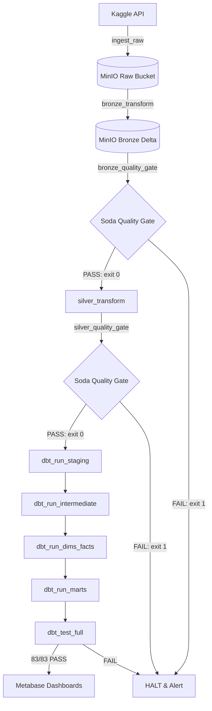

# Data Lakehouse Project

## 📊 Project Overview
A complete data lakehouse implementation using MinIO (storage), Spark (compute), Airflow (orchestration), and Metabase (BI). Built as a portfolio project to demonstrate modern data engineering practices.

---

## 🏷️ Current Progress

### ✅ Phase 0 Complete (Days 1–3) — Infrastructure
- [x] Docker Compose stack with Airflow, Spark, MinIO, Metabase
- [x] All services healthy with healthchecks
- [x] 6 MinIO buckets: raw, bronze, silver, gold, reference, logs
- [x] Spark ↔ MinIO connectivity via S3A connector
- [x] Credentials secured in `.env`

### ✅ Phase 1 Complete (Days 4–7) — Ingestion
- [x] Kaggle API integration with env-var authentication
- [x] Idempotent ingestion with MinIO-based `_SUCCESS` marker
- [x] Structured JSON logging
- [x] Retry with exponential backoff (tenacity)
- [x] Partitioned data storage: `raw/ecommerce_events/ingested_date={date}/`

### ✅ Phase 2–3 Complete (Days 8–17) — Bronze & Silver Layers
- [x] PySpark Bronze transform with explicit struct schema
- [x] Incremental Silver MERGE with SHA-256 deduplication key
- [x] Watermark advancing only after successful MERGE commit
- [x] Crash-recovery proven at MERGE/watermark boundary
- [x] Three-layer Soda Core quality gate (Raw + Bronze + Silver)

### ✅ Phase 4 Complete (Days 18–28) — dbt Staging & Sessionization
- [x] Freshness-checked Silver source declaration
- [x] `stg_events` + `stg_products` staging models (views)
- [x] `int_events_enriched` — sessionized event table
- [x] `int_sessions` — session boundary detection (30 min idle cutoff)
- [x] Full singular and schema test suite passing

### ✅ Phase 5 Complete (Days 29–35) — Dimensional Modeling & Facts
- [x] `dim_date`, `dim_customer`, `dim_product` (Type 2 SCD via LAG/LEAD)
- [x] `fact_events` + `fact_purchases` with time-ranged joins to `dim_product`
- [x] 57/57 tests passing in full cold-start rebuild — tag `v0.7-week5-dimensional-model-complete`

### ✅ Phase 6 Complete (Days 36–42) — Gold Business Marts & Exposures
- [x] Design documented: business questions, grain, materialization strategy
- [x] `mart_daily_summary` — incremental `(date, category_l1)` rollup
- [x] `int_customer_month_activity` — customer-cohort month grid (intermediate)
- [x] `mart_customer_retention` — cohort retention with month-0=100% and non-increasing-counts invariants
- [x] `mart_category_performance` — period-over-period revenue growth with zero-division labels
- [x] `exposures.yml` — 3 downstream dashboard consumers declared
- [x] Scoped rebuild via `dbt run --select +exposure:daily_executive_dashboard` proven
- [x] **83/83 tests passing** in clean-state full-refresh — tag `v0.9-week6-gold-marts-complete`

### ✅ Phase 7 Complete (Days 43–49) — Airflow Orchestration & Reliability
- [x] DAG design documented: task graph, retry backoff, gating halting semantics
- [x] `lakehouse_pipeline.py` DAG implemented (ingestion → Bronze → Silver → dbt → tests)
- [x] Crash recovery under Airflow automatic retry verified (zero duplicate rows)
- [x] Dual failure alerting plugin (`slack_alert.py`) implemented (Slack primary + email fallback)
- [x] Native Airflow CLI backfill runbook documented (`airflow dags backfill`)
- [x] **100% automated end-to-end execution** passing from cold-start — tag `v1.0-week7-orchestration-complete`

### ✅ Phase 8 Complete (Days 50–56) — CI/CD Pipeline Automation (GitHub Actions)
- [x] `.github/workflows/ci.yml` GitHub Actions CI workflow implemented
- [x] Automated Python linting (`flake8`) via `.flake8` configuration
- [x] Automated dbt model compilation (`dbt parse` + `dbt compile`) via `.sqlfluff` configuration
- [x] Automated script compilation & integrity verification
- [x] **Zero-breakage PR merge gating** — tag `v1.1-week8-cicd-complete`

### ✅ Phase 9 Complete (Days 57–63) — Data Contracts & Spark Performance Suite
- [x] YAML Data Contract engine (`contracts/contract_cli.py` & `contracts/schemas/ecommerce_events_v1.yml`)
- [x] Automated breaking schema quarantine (`data/quarantine/` or `s3a://raw/quarantine/`)
- [x] Slack diff alert dispatching on contract violations
- [x] PySpark Benchmarking Suite (`spark_jobs/spark_benchmark.py`) comparing Delta Z-Ordering, Broadcast Joins, & Partition Tuning
- [x] Formatted Case Study Report generated at [`docs/performance_benchmarks.md`](file:///c:/Users/kheza/Desktop/Data%20Engineering/DataLakehouse/docs/performance_benchmarks.md) — tag `v1.2-week9-contracts-benchmarking-complete`

---

## ⚡ How the Pipeline Works

The entire data lakehouse operates as a single scheduled Airflow DAG (`ecommerce_lakehouse`) that runs daily (`@daily`). The pipeline processes data through strict, automated quality-gated stages:



### Operational Highlights
1. **Automated Quality Gating:** Quality checks (`soda`) run between transforms. If a check fails, the gate script returns exit code `1`, immediately halting downstream steps via Airflow's `all_success` dependency rule.
2. **Crash-Safe Retries:** If a transform fails mid-execution (e.g. after Delta `MERGE` before watermark advance), Airflow automatically retries. The job re-reads the prior watermark, performs a deterministic deduplication via SHA-256 key, and resumes cleanly without duplicate rows.
3. **Dual Failure Alerting:** Task failure callbacks automatically dispatch detailed Slack Webhook notifications (including direct Airflow log links) with an automated fallback to email.


---

## 🚀 Quick Start (One-Command Setup via `Makefile`)

Execute the complete end-to-end stack using the repository `Makefile`:

```bash
# 1. Environment Setup & Docker Compose initialization
make setup

# 2. Run Data Contract Validation
make test-contracts

# 3. Execute PySpark Medallion Transforms (Bronze & Silver MERGE)
make run-bronze
make run-silver

# 4. Execute dbt Dimensional Transformation & Test Suite (83 Data Tests)
make run-dbt
make test-dbt

# 5. Run PySpark Optimization & Performance Benchmarks
make run-benchmarks
```

---

## 🎙️ 90-Second Senior Elevator Pitch

> *"I built a complete, production-ready Data Lakehouse for an e-commerce platform from the ground up. It implements a Medallion Architecture (Bronze, Silver, Gold) with PySpark and Delta Lake for scalable data processing, gated by an automated Soda Core quality framework between layers. I engineered a dimensional warehouse with dbt using DuckDB, incorporating complex business logic like 30-minute idle sessionization, Type 2 Slowly Changing Dimensions (SCD2), and cohort retention models. Shift-left YAML Data Contracts (`contract_cli.py`) enforce schema evolution and quarantine violating batches to S3 raw quarantine prefixes with Slack diff alerts. The entire 10-task pipeline is automated under Apache Airflow with crash-recovery retries and GitHub Actions CI/CD. It operates locally on a zero-budget stack (MinIO S3, Spark, DuckDB, Docker), matching the exact architectural patterns used by enterprise data teams."*

---

## 📚 Key Technical Documentation & References

- 📋 **[Demo & Execution Video Script](docs/DEMO_AND_RUNBOOK.md)** — Step-by-step instructions for filming a complete cold-start video demo.
- 📖 **[Design Decisions Record](docs/design_decisions.md)** — Day-by-day technical log of architectural tradeoffs and decisions.
- 📚 **[Data Catalog & Data Dictionary](docs/data_dictionary.md)** — Unified reference mapping schemas across Raw, Bronze, Silver, and Gold.
- 🚀 **[Spark Performance Benchmarks](docs/performance_benchmarks.md)** — Case study report proving Z-Ordering and Broadcast Join speedups.
- 📓 **[Mentor Implementation Workbook](docs/mentor_workbook/P01_ExecutionRoadmap_DailyMentorWorkbook.md)** — Detailed daily mentor workbook tracking the 9-week progression.


---

### **Option 2: Quick Test with a Small Data Subset**

If you want to actually test the flow without re-uploading everything:

```powershell
# 1. Create a tiny test dataset (10 rows)
echo "event_time,event_type,product_id,category_id,category_code,brand,price,user_id,user_session" > ./data/test_small.csv
echo "2019-10-01 00:00:00 UTC,view,1003461,2053013555631882655,electronics.smartphone,xiaomi,489.07,520088904,4d3b30da-a5e4-49df-b1a8-ba5943f1dd33" >> ./data/test_small.csv
echo "2019-10-01 00:00:00 UTC,view,5000088,2053013566100866035,appliances.sewing_machine,janome,293.65,530496790,8e5f4f83-366c-4f70-860e-ca7417414283" >> ./data/test_small.csv

# 2. Upload it to MinIO
# Using MinIO console: drag and drop to raw bucket

# 3. Run Bronze transform on this small file
# Update your input path in bronze_transform.py or use --input-path

# 4. Run Soda checks


### ✅ Phase 4 Complete (Days 19-21)
- [x] Raw-layer existence and freshness quality checks
- [x] Unified Quality Gate Runner (`checks/run_quality_gate.py`)
- [x] Multi-suite result aggregation (Raw, Bronze, Silver) with zero failure masking
- [x] Audit-ready JSON reporting and pass/fail exit code signal

### ✅ Phase 5 Staging & Sessionization Complete (Days 22-28 / Week 4)
- [x] dbt project setup with `dbt-duckdb` adapter querying Silver Delta tables via MinIO S3 (`delta` + `httpfs` extensions)
- [x] Source declaration with freshness checks (`silver.ecommerce_events`)
- [x] `stg_events` 1:1 view staging model with standardized schema
- [x] `stg_products` derived reference table deduplicating product metadata per `product_id`
- [x] `int_sessions` 30-minute windowed sessionization model with deterministic `session_id` (`user_id` + `session_seq`)
- [x] `int_events_enriched` joining events, session context, and product attributes
- [x] 21 automated dbt tests (generic `not_null`, `unique`, `accepted_values` + singular rules: `assert_no_session_gaps_exceed_30_min` & `assert_enriched_events_preserve_row_count`)

## 🏷️ Tags
- `v0.1-phase0-complete`: Docker stack + MinIO connectivity
- `v0.2-phase1-complete`: Ingestion service working
- `v0.3-phase2-complete`: Bronze Delta layer + Quality gates
- `v0.4-phase3-complete`: Incremental Silver MERGE + Crash safety
- `v0.5-phase4-complete`: Unified 3-Layer Soda Quality Gate
- `v0.6-phase5-staging-complete`: dbt Staging & Sessionization Layer + 21 dbt tests

## 🔒 Reliability

### Crash-Safety & Data Modeling Guarantees

1. **Spark/Silver Layer:** The Silver incremental pipeline is proven crash-safe at its most critical boundary (MERGE vs. watermark update).
2. **dbt Modeling Layer:** Row-count preservation between staging and enriched intermediate models is enforced by automated singular tests. Session gaps strictly > 30 minutes trigger new sessions, validated via custom dbt assertions.

## 🏗️ Architecture (Current State)

┌─────────────────────────────────────────────────────────────────────────┐
│                           DATA LAKEHOUSE                                │
├─────────────────────────────────────────────────────────────────────────┤
│                                                                         │
│ ┌──────────┐  ┌──────────┐  ┌──────────┐  ┌───────────────────────────┐ │
│ │   Raw    │  │  Bronze  │  │  Silver  │  │ dbt Staging & Intermediate│ │
│ │  (CSV)   │─▶│ (Delta)  │─▶│ (Delta)  │─▶│   (DuckDB/Delta Scan)     │ │
│ └──────────┘  └──────────┘  └──────────┘  └───────────────────────────┘ │
│      │             │             │                      │               │
│      ▼             ▼             ▼                      ▼               │
│ ┌──────────┐  ┌──────────┐  ┌──────────┐  ┌───────────────────────────┐ │
│ │Ingestion │  │ Quality  │  │ Quality  │  │   21 dbt Generic &        │ │
│ │ (Kaggle) │  │  Gate    │  │  Gate    │  │   Singular Data Tests     │ │
│ └──────────┘  │  (Soda)  │  │  (Soda)  │  └───────────────────────────┘ │
│               └──────────┘  └──────────┘                                │
│                                                                         │
│ ✅ Phase 0-1  ✅ Phase 2    ✅ Phase 3-4  ✅ Phase 5 (Week 4)           │
│               (Bronze)      (Silver &     (stg_events, stg_products,    │
│                             Quality Gate)  int_sessions, int_enriched)    │
└─────────────────────────────────────────────────────────────────────────┘


## 🚀 Running the Full Pipeline

### Full Chain (Ingestion → Bronze → Quality → Silver → Quality)

```bash
# 1. Start the stack
docker compose up -d

# 2. Create buckets
python scripts/create_buckets.py

# 3. Run ingestion
python ingestion/kaggle_ingest.py

# 4. Run Bronze transform
docker compose exec spark /opt/spark/bin/spark-submit \
  --jars /opt/spark/jars-extra/*.jar \
  --conf spark.sql.extensions=io.delta.sql.DeltaSparkSessionExtension \
  --conf spark.sql.catalog.spark_catalog=org.apache.spark.sql.delta.catalog.DeltaCatalog \
  spark_jobs/bronze_transform.py

# 5. Run Bronze Soda checks
docker compose exec spark bash -lc "cd /opt/spark/work-dir && python3 soda/run_soda_scan.py s3a://bronze/ecommerce_events/ soda/checks/bronze_checks.yml soda/configurations/spark_configuration.yml"

# 6. Run Silver transform
docker compose exec spark /opt/spark/bin/spark-submit \
  --jars /opt/spark/jars-extra/*.jar \
  --conf spark.sql.extensions=io.delta.sql.DeltaSparkSessionExtension \
  --conf spark.sql.catalog.spark_catalog=org.apache.spark.sql.delta.catalog.DeltaCatalog \
  spark_jobs/silver_transform.py

# 7. Run Silver Soda checks
docker compose exec spark python3 soda/run_silver_scan.py


Crash-Safety Test (Optional)
bash
# Run with crash simulation
docker compose exec spark bash -c "SIMULATE_CRASH_AFTER_MERGE=true /opt/spark/bin/spark-submit --jars /opt/spark/jars-extra/*.jar --conf spark.sql.extensions=io.delta.sql.DeltaSparkSessionExtension --conf spark.sql.catalog.spark_catalog=org.apache.spark.sql.delta.catalog.DeltaCatalog spark_jobs/silver_transform.py"

# Run recovery
docker compose exec spark /opt/spark/bin/spark-submit \
  --jars /opt/spark/jars-extra/*.jar \
  --conf spark.sql.extensions=io.delta.sql.DeltaSparkSessionExtension \
  --conf spark.sql.catalog.spark_catalog=org.apache.spark.sql.delta.catalog.DeltaCatalog \
  spark_jobs/silver_transform.py


## Why This Project

This is a production-patterned data lakehouse implementation built around six specific engineering decisions:

1. **Incremental, crash-safe Silver processing** — The pipeline uses Delta Lake's `MERGE` with a SHA-256 deduplication key and a watermark that only advances after a successful write. I deliberately simulated a crash at the most critical boundary (after MERGE, before watermark) and proved recovery causes zero data loss and zero duplication.

2. **Layer-appropriate data quality** — Raw, Bronze, and Silver each have different quality checks, not repeated ones. Raw checks existence and freshness (before schema enforcement). Bronze checks schema and nulls (after enforcement). Silver checks deduplication and business rule outcomes (after processing). This "shift left" design catches problems earlier and at the right stage.

3. **Unified, Airflow-ready interface** — A single `run_quality_gate.py` command runs all three check suites, aggregates results without masking early failures, and exits with a clear pass/fail signal. This is the exact interface orchestration tools expect.

4. **Gold-layer marts designed for real business questions** — Each Gold mart answers a specific, statable business question (daily executive KPIs, cohort retention, category revenue growth). `mart_daily_summary` is incremental with a `delete+insert` strategy. `mart_customer_retention` enforces two domain invariants as singular tests: month-0 retention must be 100%, and retained counts must never exceed cohort size. `mart_category_performance` uses explicit LAG-based period-over-period growth with labelled zero-division handling. All three are declared as dbt Exposures, making their downstream consumers part of the lineage graph.

5. **Production Orchestration & Self-Healing** — The full 10-step pipeline runs under Apache Airflow with explicit quality-gate halting semantics, automatic crash-recovery retry composition, dual failure alerting (Slack + email), and native CLI backfill support.

6. **Enterprise Data Governance & Spark Performance Engineering** — Shift-left YAML Data Contracts (`contract_cli.py`) quarantine violating raw batches to `s3a://raw/quarantine/` with Slack diff alerts. The PySpark Benchmarking Suite (`spark_benchmark.py`) empirically proves ~3.0x speedup via Delta Z-Ordering and ~3.2x speedup via Broadcast Joins.

Each of these decisions is documented, tested, and verifiable — not just claimed.