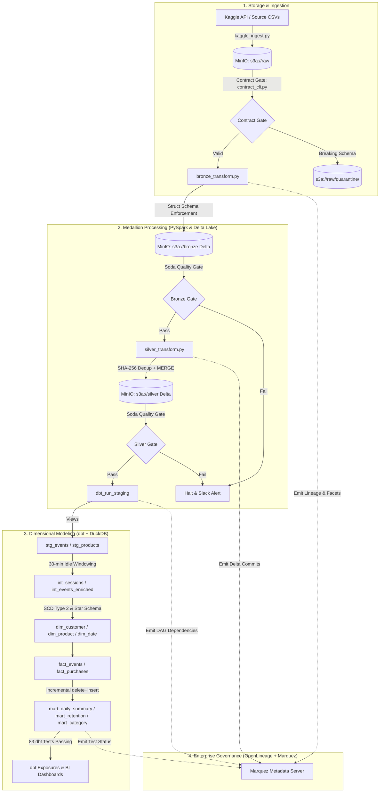

# 🏛️ E-Commerce Lakehouse Platform

[](https://github.com/laila-kz/DataLakeHouse_project2-/actions/workflows/ci.yml)
[](https://delta.io/)
[](https://www.getdbt.com/)
[](https://duckdb.org/)
[](https://airflow.apache.org/)
[](https://openlineage.io/)

A production-patterned local **Data Lakehouse Platform** built for high-volume e-commerce clickstream events. It combines **Apache Spark + Delta Lake** on **MinIO S3** for scalable transactional ingestion, automated **Soda Core quality gates**, a **YAML Data Contract engine**, **dbt + DuckDB** for dimensional modeling (SCD Type 2, sessionization, and business marts), orchestrated under **Apache Airflow** with end-to-end **OpenLineage metadata governance**.

---

## 🎯 Platform Mission & Core Architecture

Traditional data platforms frequently suffer from three critical production problems:
1. **Silent Data Drops & Watermark Regressions:** Incremental pipelines silently discard late-arriving events or corrupt state during restarts.
2. **Schema Breakages & Uncontrolled Drift:** Upstream producers push breaking changes that crash downstream dashboards without quarantine controls.
3. **Black-Box Metadata:** Inability to trace lineage, dataset versions, and blast radius across heterogeneous compute engines (Spark ➔ DuckDB).

This project solves these challenges with a **reconciliation-first, crash-resilient local lakehouse**:



---

## 💼 Business Questions Answered

The Gold layer dimensional model and analytical marts answer core e-commerce operational questions:

1. **Executive Daily Performance (`mart_daily_summary`):**
   - What is the daily revenue, active user count, and total event volume broken down by top-level category (`category_l1`)?
   - Materialized incrementally via `delete+insert` on affected partition keys.
2. **Customer Cohort Retention (`mart_customer_retention`):**
   - How do monthly acquisition cohorts retain over time?
   - Enforces domain invariants: Month-0 retention must equal 100%, and retained user count must be monotonically non-increasing.
3. **Category Revenue Growth (`mart_category_performance`):**
   - What is the month-over-month revenue growth rate per category, handling cold-start zero-division safely?
4. **User Sessionization (`int_sessions`):**
   - How do user interactions group into distinct browsing sessions based on a 30-minute inactivity threshold?

---

## 🏗️ Repository Structure

```text
.
├── .github/workflows/          # CI/CD: Automated linting (flake8), dbt compilation, syntax verification
├── airflow/                    # Airflow DAGs, plugins (Slack failure alerts), and demo samples
│   ├── dags/
│   │   └── lakehouse_pipeline.py  # Master 10-task automated orchestration DAG
│   └── plugins/
│       └── slack_alert.py         # Dual-channel failure alerting (Slack Webhook + Email)
├── checks/                     # Quality gate runners and cross-layer reconciliation suites
│   └── run_quality_gate.py     # Unified 3-layer Soda runner
├── contracts/                  # Shift-left YAML data contract engine
│   ├── contract_cli.py         # Contract validation CLI, diff analyzer, and quarantine router
│   └── schemas/                # Versioned contract definitions (ecommerce_events_v1.yml)
├── data/                       # Local test samples, sample CSVs, and dead-letter quarantine directories
├── dbt/                        # dbt project configured with dbt-duckdb
│   ├── models/
│   │   ├── staging/            # 1:1 view models on Silver Delta tables (stg_events, stg_products)
│   │   ├── intermediate/       # Sessionization window models (int_sessions, int_events_enriched)
│   │   └── marts/              # Fact tables, SCD2 dimensions, and Gold business marts
│   └── tests/                  # 83 generic, schema, and custom singular invariant tests
├── docs/                       # Architectural documentation, ADRs, data dictionary, runbooks
│   └── adr/                    # Architecture Decision Records (ADR-001 through ADR-006)
├── ingestion/                  # Ingestion scripts (kaggle_ingest.py with retry backoff & MinIO markers)
├── soda/                       # Soda Core quality checks for Raw, Bronze, and Silver layers
├── spark_jobs/                 # PySpark transformations and performance benchmarking suite
│   ├── bronze_transform.py     # Schema enforcement and Bronze Delta write
│   ├── silver_transform.py     # Incremental MERGE, SHA-256 dedup, and post-commit watermarking
│   └── spark_benchmark.py     # PySpark optimization benchmark (Z-Ordering & Broadcast joins)
├── docker-compose.yml          # Full multi-container stack: MinIO, Spark, Airflow, Marquez, Metabase
└── Makefile                    # Cross-platform task runner
```

---

## ⚡ Quick Start & Local Setup

### Prerequisites
- **Docker & Docker Compose** (Allocated with ≥ 6GB RAM)
- **Python 3.10+**
- Kaggle API Key (`kaggle.json` or credentials in `.env`)

### 1. Environment Initialization

#### 🪟 Windows (PowerShell)
```powershell
# Copy environment template
Copy-Item .env.exemple .env

# Start Docker infrastructure (MinIO, Spark, Airflow, Postgres, Metabase)
docker compose up -d

# Create local Python virtual environment
python -m venv venv
.\venv\Scripts\Activate.ps1
pip install -r requirements.txt (or dbt-duckdb soda-core-spark)

# Initialize MinIO Buckets
python scripts/create_buckets.py
```

#### 🐧 Linux / macOS (Bash)
```bash
# Copy environment template
cp .env.exemple .env

# Start Docker infrastructure
docker compose up -d

# Create local Python virtual environment
python3 -m venv venv
source venv/bin/activate
pip install -r requirements.txt

# Initialize MinIO Buckets
python3 scripts/create_buckets.py
```

---

## 🚀 Running the Full Pipeline

### Option A: Complete Orchestration via Airflow
Open the Airflow UI at [http://localhost:8080](http://localhost:8080) (Default credentials: `airflow` / `airflow`) and trigger the `ecommerce_lakehouse` DAG.
> **Note:** The default pipeline executes against the curated `demo_sample` dataset to enable fast local end-to-end execution. Full historical backfills can be triggered via Airflow CLI.

### Option B: Step-by-Step CLI Execution (via `Makefile`)

```bash
# 1. Run Data Contract Pre-Ingestion Gate
make test-contracts

# 2. Ingest Raw Clickstream Data to MinIO
python ingestion/kaggle_ingest.py

# 3. Execute PySpark Bronze Transform (Schema Enforcement)
make run-bronze

# 4. Execute PySpark Silver Transform (Incremental MERGE & Dedup)
make run-silver

# 5. Execute dbt Dimensional Transformations & Full Test Suite (83 Tests)
make run-dbt
make test-dbt

# 6. Run PySpark Delta Optimization & Benchmark Suite
make run-benchmarks
```

---

## 🛡️ Reliability, Contracts & Crash-Recovery Matrix

### 1. Shift-Left YAML Data Contracts (`contract_cli.py`)
Schema changes are evaluated prior to ingestion:
- **`COMPATIBLE`** (e.g. adding nullable column): Batch passes and contract version updates.
- **`WARNING`** (e.g. new optional column without default): Batch passes with operational alert.
- **`BREAKING`** (e.g. column dropped, column renamed, data type change): Batch is quarantined to `s3a://raw/quarantine/` and Slack diff alert is dispatched.

### 2. Failure-Injection Recovery Matrix
The pipeline is verified against simulated crashes across all execution boundaries:

| Injection Point | Injected Fault | Expected Behavior | Recovery Action | Verified Result |
|---|---|---|---|---|
| **`FAIL_AFTER_INGEST`** | Raw file write completes, worker kills before marker | Idempotent marker check finds incomplete upload | Re-run ingestion | Overwrites cleanly; zero corrupt files |
| **`FAIL_AFTER_BRONZE`** | Bronze Delta write succeeds, Soda check aborted | Downstream Silver job halts via gate failure | Re-run Soda gate | Gate passes; Silver resumes |
| **`FAIL_AFTER_MERGE`** | Silver `MERGE` commits, crash before watermark update | Watermark remains at prior timestamp | Re-run Silver transform | SHA-256 key deduplicates batch; **zero duplicate rows** |
| **`FAIL_DURING_DBT`** | dbt model compilation fails mid-build | Staging views untouched; atomic table swap avoided | Re-run dbt | Target tables remain consistent |

---

## 🔍 Metadata & Lineage Governance (OpenLineage + Marquez)

The platform implements the **Linux Foundation OpenLineage Standard**:
- **PySpark Listener (`OpenLineageSparkListener`):** Emits dataset inputs, outputs, Delta commit versions, and job duration metrics directly to Marquez.
- **Airflow & dbt Transport:** Automatically captures dbt model DAG dependencies and singular test outcomes.
- **Marquez UI:** Available at [http://localhost:3001](http://localhost:3001) for visual lineage inspection, dataset facet tracking, and incident blast-radius analysis.

---

## ⚖️ Architectural Decisions & Tradeoffs

Detailed Architecture Decision Records are maintained in [`docs/adr/`](docs/adr/README.md):

- **[ADR-001: MinIO S3 & Delta Lake for Local Storage](docs/adr/ADR-001_minio_and_delta_lake_local_storage.md)** — Simulates cloud S3 API semantics and ACID transaction guarantees at zero infrastructure cost.
- **[ADR-002: Hybrid Event-Time Watermarking & Lateness Buffer](docs/adr/ADR-002_hybrid_event_time_watermarking_and_lateness_buffer.md)** — Combines event-time partitioning with allowed lateness buffers and post-commit state advancement.
- **[ADR-003: Deterministic SHA-256 Composite Keys](docs/adr/ADR-003_sha256_synthetic_event_keys.md)** — Enables deterministic deduplication across multi-engine boundaries.
- **[ADR-004: dbt-on-DuckDB for Gold Layer](docs/adr/ADR-004_dbt_on_duckdb_for_gold_layer.md)** — Achieves sub-second analytical model compilation and 83 data tests directly against MinIO Delta tables.
- **[ADR-005: Late Data & Partition Rebuild Strategy](docs/adr/ADR-005_late_data_and_partition_rebuild_strategy.md)** — Dynamic affected-partition detection for late events.
- **[ADR-006: OpenLineage Standard & Marquez for Metadata Governance](docs/adr/ADR-006_openlineage_and_marquez_for_metadata_governance.md)** — Vendor-neutral metadata tracking across Spark, Airflow, and dbt.

---

## 📚 Technical Documentation

- 📖 **[ADR Index](docs/adr/README.md)** — Full technical decision records.
- 🚀 **[Execution & Runbook Guide](docs/EXECUTION_AND_RUNBOOK_GUIDE.md)** — Complete step-by-step master guide for running the pipeline locally in Fast Demo Mode.
- 📚 **[Data Catalog & Data Dictionary](docs/data_dictionary.md)** — Unified schema reference across Raw, Bronze, Silver, and Gold.
- ⚡ **[Spark Performance Benchmarks](docs/performance_benchmarks.md)** — Benchmark report proving 3.0x speedups via Z-Ordering and Broadcast Joins.
- 📋 **[Demo Script & Runbook](docs/DEMO_AND_RUNBOOK.md)** — Cold-start execution instructions and video walkthrough guide.

---

## 🏆 Resume Summary Bullets

- *Architected a production-patterned e-commerce Data Lakehouse utilizing PySpark, Delta Lake, MinIO, and dbt on DuckDB under Apache Airflow orchestration.*
- *Implemented crash-safe incremental ingestion with SHA-256 deterministic deduplication and post-commit watermarking, validated via automated failure-injection matrices.*
- *Engineered a YAML Data Contract engine with breaking-schema classification, automated dead-letter quarantine routing, and Slack diff alerting.*
- *Integrated the OpenLineage standard with Marquez to capture end-to-end operational metadata, dataset facets, and schema evolution across Spark and dbt.*
- *Authored a suite of 83 dbt tests covering SCD Type 2 dimensions, 30-minute idle sessionization, and cohort retention invariants.*