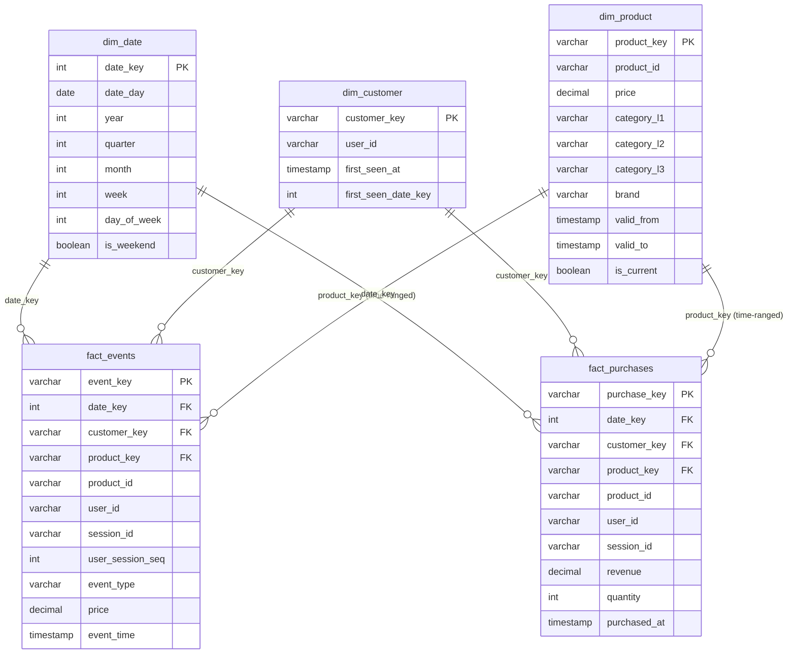

# Week 5 ER Diagram — Dimensional Model

## Notes

- `dim_product` uses **Type 2 SCD** — `product_key` is a surrogate; fact tables join via
  `fact.event_time >= dim_product.valid_from AND (fact.event_time < dim_product.valid_to OR dim_product.valid_to IS NULL)`
- `dim_customer` is **Type 1** (thin dimension, no history tracking).
- `dim_date` covers 2019-01-01 → 2027-12-31 to accommodate all event timestamps.
- `fact_events` grain: 1 row per event (all event types).
- `fact_purchases` grain: 1 row per purchase event (`event_type = 'purchase'`). Revenue = price at event time.
